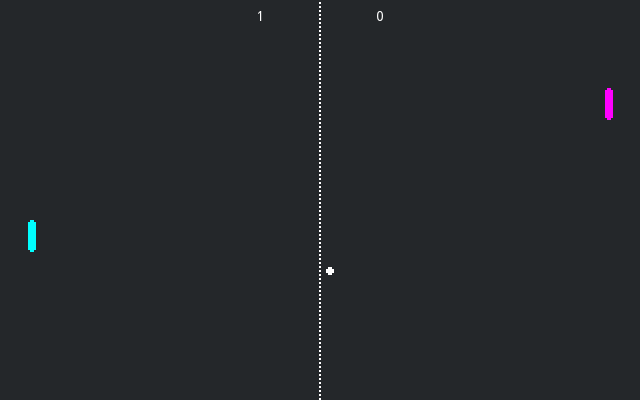

# Xbox Pong Royale

A retro, Xbox-green-themed Pong demo that ships with two modes:

* **Start Run** — single-player roguelike *Highscore Hustle*. Big-number
  combo scoring, modifier draft between waves, three boss battles
  (The Wall, The Twins, Speed Demon).
* **Versus** — the original multiplayer pong, reachable from the title
  screen's Versus entry. Host on one machine, type the host's IP on the
  other, hit Join.

Built on top of `addons/godot_gameinput`, `addons/godot_gdk`, and
`addons/godot_playfab`, so the sample also serves as a working integration
test for the controller, Xbox, and PlayFab flows:

* GameInput drives all in-game input (left-stick / D-pad → `move_up` /
  `move_down`) via the bundled `gameinput_actions.tres` mapper.
* The GDK bootstrap autoload runs at startup (it warns and stays out of
  the way when there's no Xbox title ID configured, so the sample is
  fully playable on a dev box).

Languages: GDScript + the two addon DLLs.

Renderer: Compatibility.

Note: The original (non-multiplayer) demo this was forked from lives at
[godotengine/godot-demo-projects/2d/pong](https://github.com/godotengine/godot-demo-projects/tree/master/2d/pong).

## Modes

### Start Run (Roguelike — Highscore Hustle)

A Balatro-flavored remix of pong: short, juicy, decision-driven. Every
paddle hit scores `chips × mult`; rallies build a combo; clear a wave's
target score and pick a modifier from a 3-card draw. Runs are short, the
numbers get big, and your build compounds.

* **Hit-based scoring.** Each player hit = `chips × mult`, where chips
  scale with ball speed and mult grows with your combo (`+0.1` per chain
  step). Win the rally → bonus = `combo × 25`. Miss → reset combo, lose a
  life. Lives start at three; run ends at zero.
* **Wave = a "blind".** Hit the wave's `target_score` (scales
  superlinearly per wave) and the wave clears. Boss waves apply a target
  multiplier of ~2.0–2.8× and a unique mechanic.
* **Modifier draft.** After every wave, pick 1 of 3 random modifiers
  (Balatro-style "jokers"). They stack across the run. Twelve modifiers
  ship today across common / uncommon / rare tiers, including:
  * **Heavy Hitter** — +4 chips per hit
  * **Combo King** — combo grows twice as fast
  * **Lucky Punch** — 25% chance a hit doubles its score
  * **Glass Cannon** — +1.5 mult, but lose 2 lives on miss
  * **Galaxy Brain** — 3× wave clear bonus
* **Consumables (X / Y / RB or 1 / 2 / 3).** Wave clears drop a one-shot
  consumable into one of three HUD slots (bosses guarantee two drops).
  Fire one any time during a rally:
  * **❄ Freeze Ball** — locks every ball in place for 1.4 s. Reposition.
  * **✚ Aim Shot** — your next hit fires at the AI's farthest edge.
  * **✦ Mega Hit** — next hit is worth 3× chips and gets a free +1 mult.
  * **◐ Slow Mo** — engine timescale drops to 0.45 for 1.6 s. Reads.
* **Bosses (every 3rd wave, rotating):**
  * **The Wall** — 3× tall AI paddle, slow but punishing. Aim for gaps.
  * **The Twins** — two balls in play. Manage both.
  * **Speed Demon** — single ball, bounces ratchet speed hard.
* **Difficulty curve.** Wave 1 starts soft (paddle speed 135, big tracking
  jitter) so newcomers can climb into the first boss. By the late game the
  AI is frame-tight. Bosses keep their own paddle profile and a small
  jitter so even the toughest boss feels beatable.
* **Pacing.** 1.2 s pre-wave countdown, ball starts at 220 px/s and
  scales per wave. The HUD shows a target progress bar, big combo
  counter, the consumable strip (bottom-left), and a strip of your
  active modifiers (bottom-right).
* **Run end** → name entry → score (and max combo) are submitted to the
  PlayFab leaderboard and the high-score / total runs are persisted
  through the PlayFab Game Saves folder.

### Customize (Ball skins)

The title screen's CUSTOMIZE entry opens a full-screen skin picker. Two
skins (Xbox logo and Classic) are free; five more unlock by playing:

* **Comet** — defeat The Wall.
* **Twin Star** — defeat The Twins.
* **Velocity** — defeat Speed Demon.
* **Hot Streak** — chain a 25-hit combo in a single rally.
* **Champion** — finish a run with 5,000+ score.

Selection persists through the sample's PlayFab service wrapper (which
round-trips the save through PlayFab Game Saves when configured) and is
applied to the primary ball at spawn.

### Title screen (Original Xbox dashboard)

The new `title.tscn` is rendered entirely in `_draw()` to mimic the
original Xbox dashboard look — polar wireframe grid, central pulsing X
orb with reflection, and tab-style menu items with a hand-drawn fin and
mini-orb on focus. Five entries: **START RUN**, **VERSUS**,
**CUSTOMIZE**, **LEADERBOARD**, **QUIT**.

### Controller / keyboard map

GameInput owns the controller exclusively while it's initialized, so we
explicitly map UI navigation through `gameinput_actions.tres`:

| Action            | Controller             | Keyboard      |
| ----------------- | ---------------------- | ------------- |
| Move paddle       | Left stick Y / D-pad   | W/S, ↑/↓      |
| UI navigate       | Left stick / D-pad     | Arrow keys    |
| Confirm           | A                      | Enter / Space |
| Cancel / Back     | B                      | Esc           |
| Consumable slot 1 | X                      | 1             |
| Consumable slot 2 | Y                      | 2             |
| Consumable slot 3 | Right Bumper           | 3             |

### Versus (Multiplayer)

The original lobby + pong arena, reachable from the Versus title button.
Host or join over LAN; rumble + paddle hits route through GameInput on
both peers.

### Leaderboard

Top-10 view populated by Start Run submissions. The sample-local
`PlayFabService` autoload signs the current Xbox user into the real
`PlayFab` singleton, submits roguelike scores to the `PongLB` leaderboard
(backed by the `PongLBScore` stat) under the player's gamertag, and caches
the latest query results for the UI.

## Configuring Xbox Live + PlayFab

The sample is fully playable on a dev box without any Xbox configuration —
you'll just see `GDK OFFLINE` in the title screen HUD and PlayFab features
(cloud saves, leaderboard) will be disabled. To exercise the live services:

1. **Configure Partner Center IDs.** The sample reads Xbox Live config
   from `sample_config.cfg` (gitignored — see `sample_config.cfg.template`
   for the schema). Either run `tools\setup_sample.ps1` to generate it
   interactively, or use the **GDK Setup** dock in the editor. Both flows
   are documented end-to-end in
   [`docs/godot-gdk-sample-setup.md`](../../docs/godot-gdk-sample-setup.md).
2. **Set your PC sandbox + sign in a test account.** Follow
   [`docs/xbox-sandbox-and-test-account-setup.md`](../../docs/xbox-sandbox-and-test-account-setup.md).
   That doc covers `XblPCSandbox.exe`, the Xbox app sign-in flow,
   `XblDevAccount.exe`, resetting player data, and the troubleshooting
   table for the most common HRESULTs.
3. **Set the PlayFab title ID.** PlayFab leaderboard and Game Saves wrapper
   only run when `playfab/runtime/title_id` is set in the **Project Settings**
   (and optionally `playfab/runtime/endpoint` for self-hosted environments). The
   GDK Packaging panel and the export dialog both surface this field; you
   can also set it directly in `project.godot`.

### Verifying via the title HUD

The title screen has a corner HUD that lets you confirm sandbox + account
are wired up at a glance:

| HUD readout | Meaning |
|---|---|
| `GDK OFFLINE` (red ring) | No Title ID / SCID, or the extension failed to load. |
| `GDK INIT…` (yellow ring) | Runtime is starting; should resolve immediately. |
| `GDK READY · SIGNED OUT` | Runtime is up but no Xbox user is bound. Sandbox/account mismatch. |
| `GDK READY · SIGNED IN` + gamertag + avatar | Everything is configured correctly — leaderboards and Game Saves should work. |

The HUD listens to `GDK.users.user_changed`, so it updates live
when you sign a user in or out without restarting the sample.

## PlayFab service

The sample registers `PlayFabService` as an autoload. It wraps the real
`PlayFab` root singleton so the rest of the demo can keep using simple
save/leaderboard helpers while the service handles:

* `PlayFab.initialize()` and sign-in for the active Xbox user
* Game Saves folder discovery / sync, JSON save reads and writes, and
  upload UI
* leaderboard submission / query against `PongLB` (stat `PongLBScore`),
  keyed off the signed-in player's Xbox gamertag

Configure `playfab/runtime/title_id` (and optionally `playfab/runtime/endpoint`) in the
project settings or through the packaging panel before expecting cloud
save and leaderboard sync to succeed.

## Screenshots

